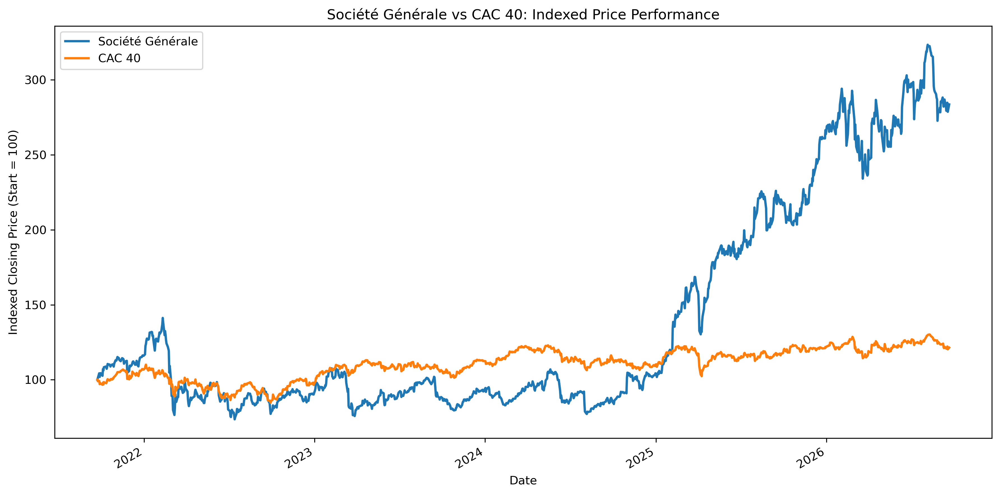
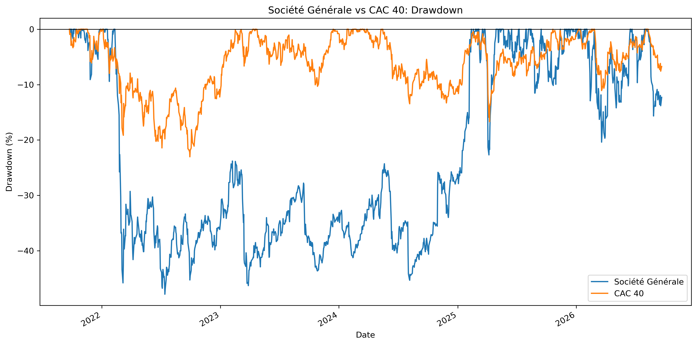
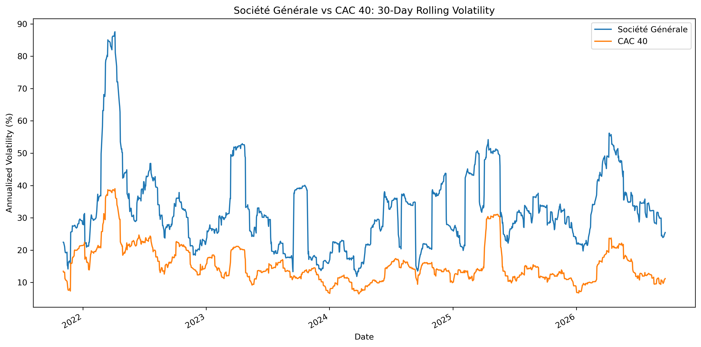

# Société Générale vs CAC 40: Price and Risk Analysis

## Overview

This project compares the historical price performance and risk profile of Société Générale with the CAC 40 using Python.

## Research Question

How did Société Générale (`GLE.PA`) perform relative to the CAC 40 (`^FCHI`) between 23 September 2021 and 21 September 2026 in terms of price return, CAGR, annualized volatility, maximum drawdown, and 30-day rolling volatility?

## Data

- **Source:** Yahoo Finance, accessed with `yfinance`
- **Frequency:** Daily
- **Société Générale:** `GLE.PA`
- **Benchmark:** `^FCHI` (CAC 40 price index)
- **Clean common observations:** 1,279
- **Price field used:** `Close`

This is a price-performance analysis. It does not include dividends, transaction costs, taxes, or currency effects.

## Methodology

1. Download daily closing-price data with `yfinance`.
2. Align both series by trading date and remove missing observations.
3. Calculate daily percentage returns.
4. Rebase both price series to 100 on the first trading day.
5. Calculate total price return, CAGR, and annualized volatility.
6. Measure maximum drawdown from previous price peaks.
7. Calculate 30-day rolling annualized volatility.

## Key Results

| Metric | Société Générale | CAC 40 |
| --- | ---: | ---: |
| Total Price Return | 183.62% | 21.44% |
| CAGR | 23.21% | 3.97% |
| Annualized Volatility | 34.43% | 16.33% |
| Maximum Drawdown | -47.86% | -23.04% |

Société Générale delivered substantially higher price performance over the period, but with materially higher volatility and a deeper maximum drawdown than the CAC 40.

## Visualizations

### Indexed Price Performance



### Drawdown



### 30-Day Rolling Volatility



## Project Structure

```text
socgen-price-risk-analysis/
├── socgen_price_risk_analysis.ipynb
├── figures/
│   ├── indexed_price_performance.png
│   ├── drawdown.png
│   └── rolling_volatility.png
├── README.md
├── requirements.txt
└── .gitignore

pip install -r requirements.txt
jupyter notebook socgen_price_risk_analysis.ipynb

Limitations
- Historical market data may be revised by the data provider.
- Results use closing prices rather than total-return series.
- The analysis excludes dividends, transaction costs, taxes, and currency effects.
- This project is for educational purposes and is not investment advice.
Skills Demonstrated
- Python and Jupyter Notebook
- Financial data collection with yfinance
- Data cleaning with pandas
- Return and risk measurement
- CAGR, volatility, and drawdown analysis
- Financial data visualization with matplotlib
- Reproducible project organization for GitHub
  